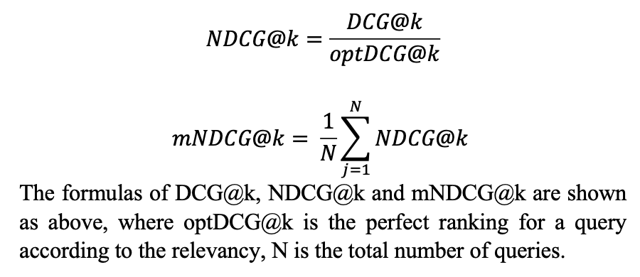

# Information_Retrieval_System
An information retrieval model is an essential component for many applications such as search,
question answering, and recommendation. Different information retrieval models are developed that solve the problem of passage retrieval, i.e. given a text query, return a ranked list of short texts (passages). More specifically, to build a passage reranking system: given a candidate list of passages for a text query, you should re-rank these candidate passages based on an information retrieval model.

## Part 1
Part 1 contains four specific tasks, Text statistics, Inverted index, Retrieval models, Query likelihood language models. 

### Data

- **test-queries.tsv** is a tab separated file, where each row contains a test query identifier
(qid) and the actual query text.

- **passage-collection.txt** is a collection of passages, one per row.

- **candidate-passages-top1000.tsv** is a tab separated file with an initial selection of at
most 1000 passages for each of the queries in test-queries.tsv. The format of this file is
**<qid pid query passage>**, where **pid** is the identifier of the passage retrieved, **query** is
the query text, and **passage** is the passage text (all tab separated). The passages contained
in this file are the same as the ones in **passage-collection.txt**. However, there might be some repetitions, i.e. the same passage could have been returned for more than 1 query.

### Task 1  Text statistics

**Preprocessing**

For each passage in **passage-collection.txt**, the following preprocessing steps are finished : 

    1.Lowercase. 
    2.Tokenisation with the regular expression of "r’\w+’". 
    3.Optional stop words removal with the stopwords module in nltk. 
    4.Stemming with snowball stemmer. 
    
    Note that "r’\w+’" will only consider words including [a-zA-Z0-9_], which means all punctuation is removed. If stop words are not removed, the size of dictionary, i.e. vocabulary, is 102613.

**Study of Zipf’s law**

Compare empirical distribution with the actual Zipf’s law distribution.
The equation of Zipf’s law is:

$$ f(k;s,N) = \frac{{k}^{-1}}{\sum_{i=1}^N{{i}^{-1}}}\label{eq:1}$$

### Task 2  Inverted index
Use **candidate-passages-top1000.tsv** for this task(unique instances of column pairs pid and passage). Using the vocabulary of terms identified in Task 1 to build an inverted index for the collection so that we can retrieve passages in an efficient way. The inverted index is to allow fast full-text searches, at a cost of increased processing when a document is added to the database. However, there is large storage overhead and high maintenance costs on updating, deleting, and inserting.

### Task 3  Retrieval Models

- Vector Space Model: TF-IDF model
    Document as vector: term t weight = term frequency of t in this document * inverse document frequency 
    Query as vector: term t weight = term frequency of t in this query * inverse document frequency 
    cosine score = inner product of D and Q/ normalized D * normalized Q
    

- Probabilistic Model: BM25

    

    **ri** - Number of judged relevant docs containing term i
    **R**  - Relevant set size (i.e., number of documents judged relevant)
    **ni** - Number of documents in the judged sample containing term i
    **N**  - Number of total documents

### Task 4  Query likelihood language models
Use **test-queries.tsv** and **candidate-passages-top1000.tsv** for this task. Implement the query likelihood language model with (a) Laplace smoothing, (b) Lidstone correction with ϵ = 0.1, and (c) Dirichlet
smoothing with µ = 50, and retrieve 100 passages from within the 1000 candidate passages for
each test query. 

## Part 2
Part 2 contains four specific tasks, Evaluating Retrieval Quality, Logistic Regression (LR), LambdaMART Model (LM), Neural Network Model (NN). 

### Data

- **train_data.tsv** **validation_data.tsv** 
These are the datasets you will be using for training and validation. You are expected to train your model on the training set and evaluate your models’ performance on the validation set. In these datasets, you are given additional relevance column indicating the relevance of the passage to the query, which you will need during training and validation.

### Task 1  Evaluating Retrieval Quality
Implement methods to compute the **average precision** and **NDCG** metrics. Compute the performance of using BM25 as the retrieval model on the validation data (validation_data.tsv) using these metrics.

### Task 2  Logistic Regression (LR)

- Embedding 
    A Word2Vec embedding model is trained with skip-gram algorithm, and negative sampling is used with 5 noise words. The window size is 5 and the dimensionality of word vector is 100. Generally, the larger dimension means the better representation of the word.

- Data Generation
    The previous text preprocessing method is adopted as well. Then it is important to observe the distribution of data for machine learning problem, from which we can find there are a large portion of data is irrelevant and only a small portion of data is relevant. This is typical imbalanced data. There several ways of dealing with this kind of imbalanced data, here a sub-sampling method is adopted by deleting instances from the over-represented class. To be more specific, for each query, we keep all relevant passage, then sample 50 passages from the rest irrelevant passages.

    After sub-sampling, the previous well-trained Word2Vec is used to generate a vector of 100 dimensions for every word in the vocabulary of the Word2Vec model. The average embedding method is chosen to represent the whole query or passage. Then I concatenate the average embedding vector of a query and that of a passage directly to form an input of logistic model. In this case, there are 95874 query-passage pairs which forms a feature matrix with shape of (95874, 200). There the corresponding train label is a vector with the shape of (95874, 1). The same processing is finished with validation set. In addition, we record all qids for training samples and validation data for the following tasks.

-   Logistic Regression Implementation
    A weighted logistic model is implemented. The difference between weighted one and unweighted one is the loss function. 

### Task 3  LambdaMART Model (LM)
This part only contains one python file, task3_LM.py. I implement a LambdaMART with the existed library XGBoost. Then 6-fold cross validation method is used to evaluate the performance of a set of hyperparameters. Then Bayesian optimization method is adopted to search a large hyperparameter space to get the best combination of hyperparameters.

### Task 4  Neural Network Model (NN)

- Input Representation
    a word-index vocabulary is generated where every word has its own index. In other words, there are 663723 words in total, so the index is from 0 to 663722. Then every query is transformed into a sequence of indices, where only words in this vocabulary are taken into consideration. Next, the sequence is padded with 0 to a fixed length of 17. The reason we choose 17 is that the max length of query is 17. Similarly, every passage is transformed into a sequence with the fixed length of 207. 207 is the number of tokens of the longest passage. Finally, the embedding matrix with the shape of (vocab_size, embedding_dim) is generated. In this case, the size of vocabulary is 663723 and embedding dimension is 100. For the word not in the Word2Vec model, the corresponding row is 0s with the shape of 100*1. As previous tasks, the same subsampling process is done for training data.

- LSTM-DSSM
    LSTM-DSSM is a variant of Deep Structured Semantic Model. The intuition behind this model is to map the query and document representations into a common semantic space. This allows the network to perform semantic matching, where the similarity between the query and document is based on their meaning rather than just their surface-level features. The LSTM layer in the architecture allows the network to capture contextual information from the query and document. The figure below shows the architecture of my LSTM-DSSM.

